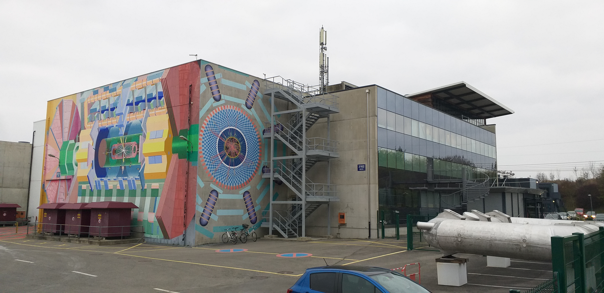

# Digitilización de señales

Bienvenidos al repositorio de la clase Temas Selectos de Instrumentacion y Electronica (Digitalización de Señales)

## Imágenes

 

 ## Tablas

 | Cabecera 1 | Cabecera 2 | Cabecera 3 |
 |------------|------------|------------|
 | Hola       | esta       | es         |
 | una        | tabla      | jijij      |

 ## Código

 A continuación, un **código** de ejemplo cómo crear variables simbolicas.  

 ~~~ 

Aquí aparece código

t=0:0.1:100;
x_t=sin(t);

%Comando plot entrega gráfica
plot(t,x_t)

~~~

## Enlaces

Más información em mi [Github](https://github.com/LuiSamaniego/digitalizacion2022-1)